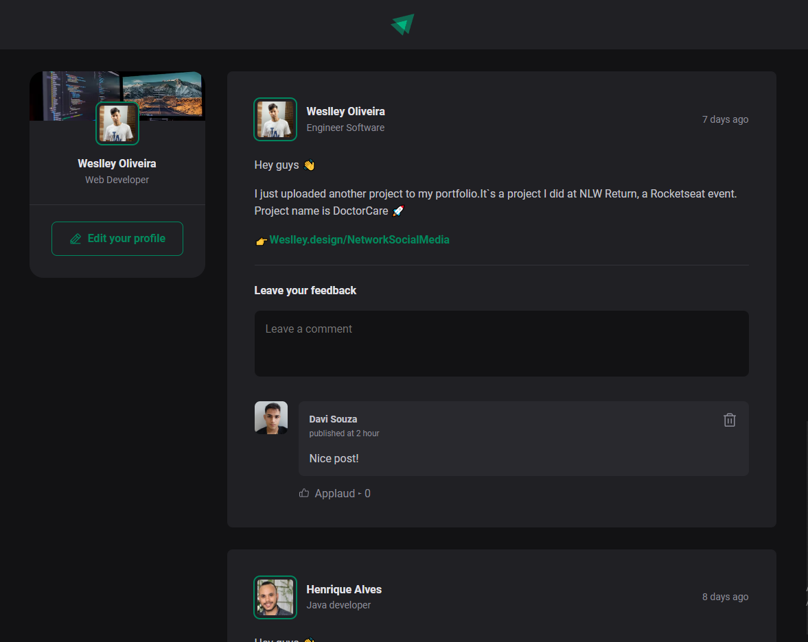

<p align="center">
  
  
  
</p>
<p align="center">
    
</p>


<br>
<br>

## 🧪 Technologies

This project was developed using the following technologies:

- [CSS](https://developer.mozilla.org/pt-BR/docs/Web/CSS)
- [TypeScript](https://www.typescriptlang.org/)
- [ViteJS](https://vitejs.dev/)
- [ReactJS](https://reactjs.org/)


## 🚀 Getting started
Clone the project and access the folder.

```bash
$ git clone https://github.com/weslleyolli/nlw-setup-ignite
$ cd nlw-setup-ignite
```

Follow the steps below:

### Web

```bash
# Install the web dependencies
$ cd web
$ npm install

# Start the web project
$ npm start
```

## 🔖 Layout

You can view the project layout through the links below:

- [Layout](<https://www.figma.com/file/K1bH0x9Bbnfy38BUwQaE2y/Ignite-Feed-(Community)?node-id=0%3A1&t=w0eJ8mckx9ZHmcTN-0>)

Remembering that you need to have a [Figma](http://figma.com/) account to access it.

---

Made with 💜 by [Weslleyolli](https://github.com/weslleyolli)👋